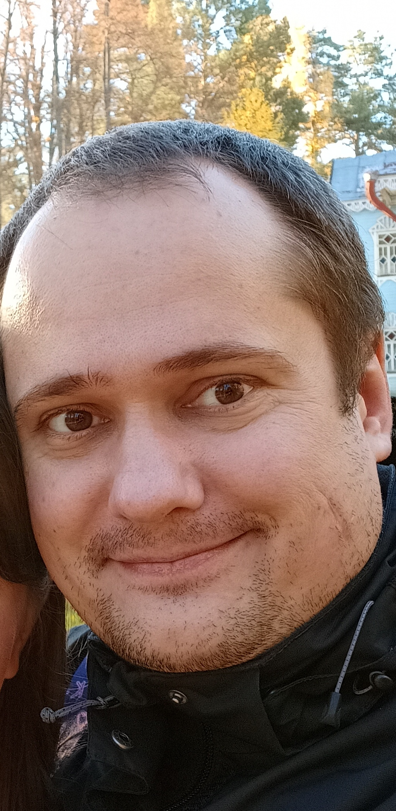

# Немного о себе

## Образование

+ В 2009 году окончил Ивановский государственный химико-технологический университет, инженер по автоматизиции технологических процессов и производств.
+ С 31 августа 2022 года прохожу обучение в Нетологии по специальности "Android-разработчик с нуля".

## Работа

+ С 2009 года работаю в государственных организациях, на данный момент являюсь заместителем начальника отдела аналитики.
+ Хочу продолжить развиваться и никогда не останавливаться на достигнутом!

